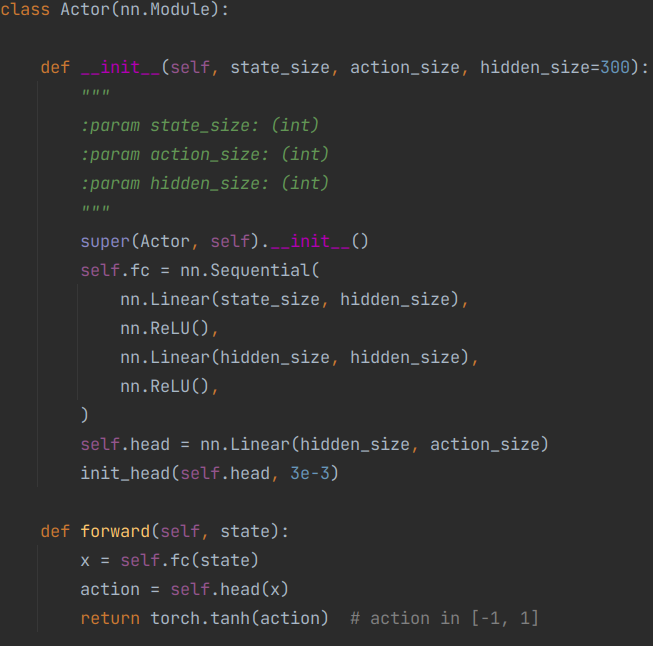
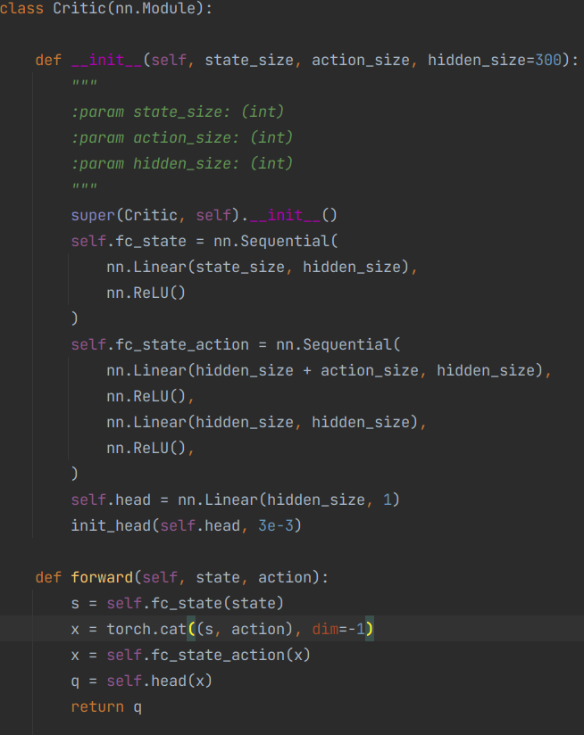

I reached score of ~0.5 at Reacher task within 2215 episodes & ~1.0 within 2800 episodes thus solved the problem, using MADDPG(Multi Agent Deep Deterministic Policy Gradient). 

## Learning Algorithm

I used Multi Agent Deep Deterministic Policy Gradient algorithm(https://arxiv.org/pdf/1706.02275.pdf).

### NN architecture

For actor network architecture, I used

For critic network architecture, I used

### Hyperparameters
* actor_lr: 5e-4 (learning rate for updating local actor network)
* critic_lr: 1e-3 (learning rate for updating local critic network)
* gamma: 0.99 (discount factor when calculating return)
* tau: 1e-3 (interpolation rate for updating target networks)
* buffer_size: 1e6 (maximum number of experiences to save in replay buffer)
* batch_size: 1024 (number of experiences to do one step of update)
* noise: 1 (initial noise added to action for exploration)
* noise_decay: 0.999 (noise decay rate per step)
* min_noise: 0.01 (minimum noise)

## Plot of Scores While Training
This plot shows average scores in past 100 episodes per episode.

## Test Performance
3 episodes avg: 1.08

## Ideas for Future Work
* Tune hyperparameters
* Make each agents care about each others reward
* Limit max steps per episode to reduce overfitting to certain episodes
